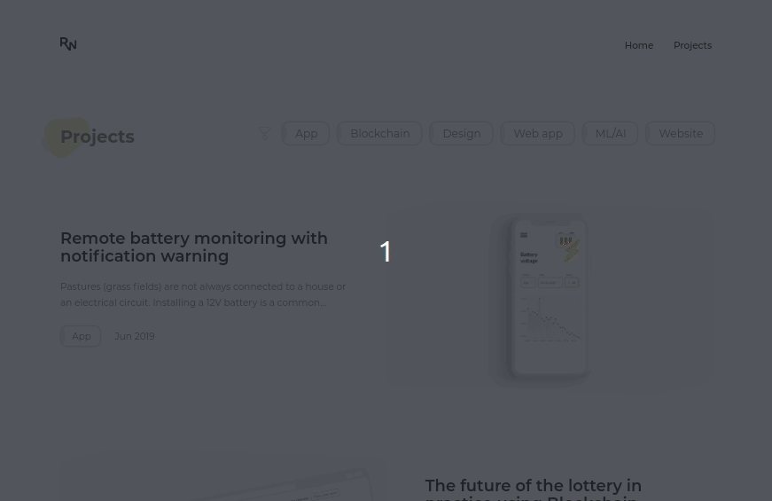

# Developer portfolio using GatsbyJS, Flow & Cockpit CMS





## 🚀 Quick start

Create an environment file (./.env):

```env
COCKPIT_TOKEN=yoursHere
GA_ID=yoursHere
```

Start the development server:

```bash
npm run start
```

Build for production:

```bash
npm run build
```

## 🤔 What to improve

- Replace Flow with Typescript since GatsbyJS has no Flow typings
